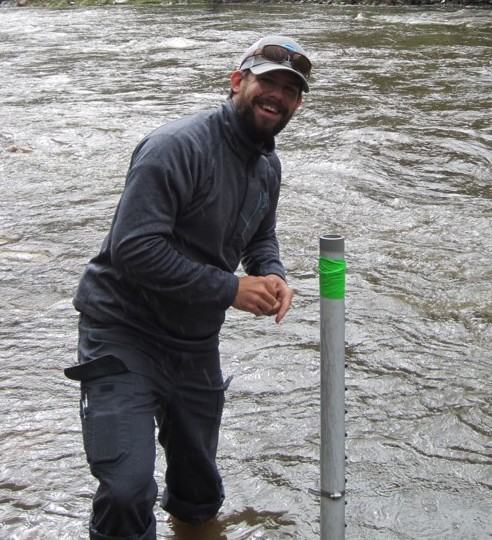

<!-- Global site tag (gtag.js) - Google Analytics -->

<!-- Post -->
<section class="post">
    <header class="major">

    </header>
        
    

    I am an NSF postdocotoral fellow at Rice University working with an <a href="https://earthscience.rice.edu/ajo-franklin-lab/">environmental geophysics group</a> in the Earth, Environmental, and Planetary Sciences Department. Water is a thread that weaves it's way through the entirety of my life, from fishing small mountain streams as a kid to whitewater rafting and kayaking. I was first exposed to groundwater during a deployment with the U.S. Army. My deployment experince combined with an innate curiosity, and a strong motivation to conserve the natural environment motivated me to pursue degrees in geoscience with a focus on hydrogeology.  I consider myself a physical hydrogeologist with a research focus on characterizing the heterogeneous subsurface structures that controls flow and transport through the subsurface. This allows me to develop predictive models that improve environmental decision making.

</section>
